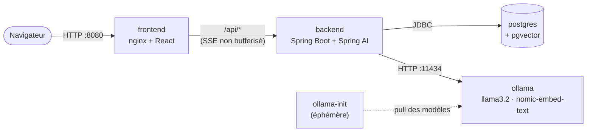
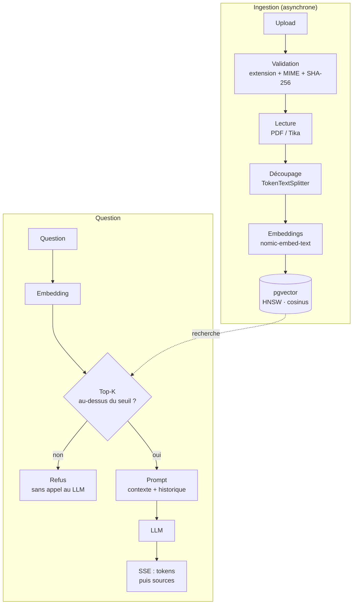

# Enterprise RAG Assistant

> **Posez vos questions à la documentation interne de l'entreprise, et obtenez une réponse sourcée, en streaming, 100 % en local.**

[](https://github.com/scorpio-uriel/enterprise-rag-assistant/actions/workflows/ci.yml)


Enterprise RAG Assistant est un assistant interne de type **RAG** (*Retrieval-Augmented Generation*). Les administrateurs importent les documents de l'entreprise (politiques RH, procédures, guides IT…), et les employés leur posent des questions en langage naturel. Chaque réponse s'appuie **uniquement** sur ces documents et **cite ses sources**. Quand l'information n'y figure pas, l'assistant le dit au lieu d'inventer.

Le LLM et les embeddings tournent avec **Ollama, sur votre machine**. Aucune donnée ne quitte l'infrastructure.

<!-- TODO J12 : GIF de démo (docs/demo.gif) -->

---

## ✨ Fonctionnalités

- 💬 **Chat en streaming (SSE)** : la réponse s'affiche token par token, comme dans ChatGPT.
- 📎 **Citations** : nom du document, page, extrait et score de similarité pour chaque réponse.
- 🚫 **Refus hors corpus** : en dessous d'un seuil de similarité, l'assistant répond « Je ne trouve pas cette information… » **sans même appeler le LLM**, ce qui limite les hallucinations.
- 📂 **Ingestion asynchrone** : PDF, DOCX, Markdown et TXT, avec contrôle du type MIME réel, détection des doublons (SHA-256) et suivi du statut `PENDING → INDEXING → INDEXED / FAILED`.
- 🧠 **Mémoire de conversation** : les questions de suivi prennent en compte les derniers échanges, et l'historique est persisté par utilisateur.
- 🔐 **Sécurité par rôles** : JWT (HS256), mots de passe BCrypt, `ADMIN` (gestion documentaire) et `USER` (chat), isolation stricte des conversations.
- 🐳 **Démarrage en une commande** : `docker compose up` lance toute la stack et télécharge automatiquement les modèles.

## 🏗️ Architecture



nginx sert les fichiers statiques **et** relaie `/api/*` vers le backend. Le navigateur ne parle qu'à une seule origine : **aucune configuration CORS n'est nécessaire**.

### Le pipeline RAG



## 🚀 Démarrage rapide

**Prérequis :** Docker et Docker Compose v2, environ **8 Go de RAM** et **4 Go d'espace disque** pour les modèles.

```bash
git clone https://github.com/scorpio-uriel/enterprise-rag-assistant.git
cd enterprise-rag-assistant
cp .env.example .env        # puis remplacez les valeurs « change-me »
docker compose up --build
```

Ouvrez ensuite **http://localhost:8080** et connectez-vous :

| Compte | Rôle | Mot de passe |
|---|---|---|
| `admin@acme.local` | ADMIN : import et gestion des documents, chat | `ADMIN_PASSWORD` du `.env` |
| `user@acme.local` | USER : chat uniquement | `USER_PASSWORD` du `.env` |

> ⏳ **Premier lancement :** le service `ollama-init` télécharge `nomic-embed-text` et `llama3.2` (environ 2,5 Go). Le backend attend la fin de ce téléchargement avant de démarrer. Les modèles sont stockés dans un volume Docker : les lancements suivants prennent quelques secondes.

### Configuration (`.env`)

| Variable | Rôle |
|---|---|
| `DB_PASSWORD` | Mot de passe PostgreSQL |
| `JWT_SECRET` | Clé de signature des JWT (**≥ 32 caractères**) |
| `ADMIN_PASSWORD` / `USER_PASSWORD` | Mots de passe des comptes de démo |
| `OLLAMA_CHAT_MODEL` | Modèle de chat (défaut : `llama3.2`). Il est téléchargé automatiquement. |

Les paramètres RAG (`top-k`, seuil de similarité, taille et chevauchement des chunks) se règlent dans [`backend/src/main/resources/application.yml`](backend/src/main/resources/application.yml).

### Commandes utiles

```bash
docker compose ps                 # état des services (ollama-init doit être « Exited (0) »)
docker compose logs -f backend    # logs du backend
docker compose down               # arrêt : documents, conversations et modèles sont conservés
docker compose down -v            # arrêt ET suppression des volumes (remise à zéro)
```

> 💡 **GPU NVIDIA :** décommentez le bloc `deploy` du service `ollama` dans `docker-compose.yml` pour accélérer fortement les réponses.

## 🧰 Stack technique

| Couche | Choix | Pourquoi |
|---|---|---|
| Backend | **Java 21, Spring Boot 4.1** | Monolithe modulaire organisé par fonctionnalité (`auth`, `document`, `chat`…), couches controller → service → repository |
| IA | **Spring AI 2.0** | Abstractions `ChatClient`, `EmbeddingModel` et `VectorStore` : on peut changer de fournisseur sans réécrire la logique |
| LLM | **Ollama** (`llama3.2`, `nomic-embed-text`) | 100 % local, gratuit, aucune donnée transmise à un tiers |
| Vecteurs | **PostgreSQL + pgvector** (HNSW, cosinus) | Une seule base pour les données métier et les vecteurs, avec un vrai SQL et des transactions |
| Migrations | **Flyway** | Schéma versionné. Hibernate se contente de le valider. |
| Sécurité | **Spring Security** (resource server JWT, BCrypt) | API stateless, rôles vérifiés côté serveur |
| Frontend | **React 19, TypeScript, Vite, TanStack Query, Tailwind** | Cache et rafraîchissement des statuts d'indexation, SSE via `fetch-event-source` |
| Exécution | **Docker Compose**, images multi-stage, **nginx** | Images légères (JRE seul, nginx alpine) et streaming préservé (`proxy_buffering off`) |

Les choix d'architecture et leurs alternatives écartées sont détaillés dans [`docs/PLAN.md`](docs/PLAN.md), et le périmètre fonctionnel dans [`docs/SPEC.md`](docs/SPEC.md).

## 🧪 Qualité et tests

- **Tests d'intégration réalistes** : `@SpringBootTest` et **Testcontainers** sur un vrai PostgreSQL + pgvector, plutôt que H2, qui ne connaît ni pgvector ni JSONB.
- **Tests de RAG sans LLM** : un `FakeEmbeddingModel` déterministe et un `ChatModel` mocké permettent de tester la recherche, le seuil et le refus en quelques millisecondes. La CI n'appelle jamais de vrai modèle.
- **Front** : Vitest, Testing Library et MSW (y compris le flux SSE).
- **CI GitHub Actions** : Spotless (google-java-format) et tests côté backend ; oxlint, Prettier, typecheck, tests et build côté frontend.

<!-- TODO J11 : résultats d'évaluation (hit rate@4, taux de mots-clés, refus des pièges) -->

## 🛠️ Développement local

Au quotidien, seule l'infrastructure tourne dans Docker. Le backend et le front tournent en local, avec rechargement à chaud.

```bash
docker compose -f docker-compose.dev.yml up -d     # postgres + ollama uniquement
cd backend && ./mvnw spring-boot:run               # http://localhost:8080
cd frontend && npm install && npm run dev          # http://localhost:5173 (proxy /api → 8080)
```

```bash
cd backend && ./mvnw verify     # tests backend + vérification du formatage
cd frontend && npm test         # tests frontend
```

> ⚠️ `docker-compose.dev.yml` et `docker-compose.yml` utilisent tous deux le port 8080 (backend local d'un côté, nginx de l'autre). Ne lancez pas les deux modes en même temps. Ils partagent en revanche les mêmes volumes (`pgdata`, `ollama`) : les modèles ne sont téléchargés qu'une fois.

## 📁 Structure du dépôt

```
.
├── backend/                 # Spring Boot (Dockerfile multi-stage)
├── frontend/                # React + Vite (Dockerfile multi-stage, nginx.conf)
├── docs/                    # SPEC.md, PLAN.md
├── docker-compose.yml       # stack complète
├── docker-compose.dev.yml   # postgres + ollama (dev local)
└── .env.example
```

## 🧭 Limites et pistes

- **JWT en `sessionStorage`** : compromis assumé pour le MVP. Une piste plus robuste serait un cookie `HttpOnly` avec une protection CSRF.
- **PDF scannés** : pas d'OCR pour l'instant.
- **Recherche** : vectorielle uniquement. Le re-ranking et la recherche hybride (BM25 + vecteurs) amélioreraient la pertinence.
- **Sans GPU**, la génération reste lente sur de gros modèles. `llama3.2` (3B) offre un bon compromis.
- **Tests E2E** (Playwright) : lancés en local plutôt qu'en CI, car ils demandent un vrai Ollama.
- Hors périmètre du MVP : SSO/OIDC, multi-tenant, fournisseurs LLM cloud, observabilité avancée.

## 📄 Licence

[MIT](LICENSE) © 2026 Uriel Arthur MILLOGO
